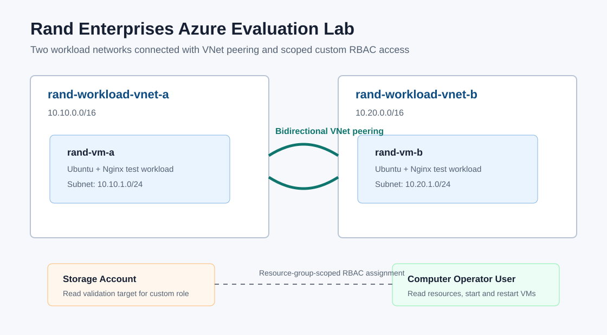

# Azure VNet Peering and Custom RBAC

Azure infrastructure project for deploying two virtual networks, placing a test VM in each network, connecting the networks with VNet peering, and assigning a scoped custom RBAC role for VM operations.

## Features

- Two Azure virtual networks in the selected region
- One Ubuntu web workload VM per VNet
- Bidirectional VNet peering for private connectivity
- Storage account for read-permission validation
- Custom RBAC role with read access to network, storage, and VM resources
- Permission to start and restart VMs only
- Employee onboarding script for the default Microsoft Entra ID tenant
- Connectivity and RBAC validation scripts

## Tech Stack

- Azure Bicep
- Azure CLI
- Microsoft Entra ID
- Azure RBAC
- Azure Virtual Network
- Azure Virtual Machines
- PowerShell

## Project Structure

```text
azure-vnet-peering-custom-rbac/
|-- assets/
|   `-- architecture.svg
|-- infra/
|   |-- main.bicep
|   `-- modules/
|       `-- linux-web-vm.bicep
|-- rbac/
|   `-- computer-operator-role.template.json
|-- scripts/
|   |-- deploy.ps1
|   |-- test-custom-role.ps1
|   `-- validate-connectivity.ps1
`-- README.md
```

## Setup

Prerequisites:

- Azure subscription with administrator access
- Azure CLI signed in as a user that can create resources, users, custom roles, and role assignments
- SSH public key for VM access
- PowerShell

Deploy the lab:

```powershell
cd scripts
.\deploy.ps1 `
  -ResourceGroupName rg-rand-vnet-rbac `
  -Location uksouth `
  -AdminUsername azureuser `
  -AdminSshPublicKey "ssh-rsa AAAA..." `
  -AdminSourceAddressPrefix "203.0.113.10/32" `
  -EmployeeDisplayName "Rand Computer Operator" `
  -EmployeeUserPrincipalName "rand.operator@yourtenant.onmicrosoft.com" `
  -EmployeePassword "Temporary-Password-Here" `
  -ProjectPrefix rand
```

Validate VNet peering connectivity:

```powershell
.\validate-connectivity.ps1 `
  -ResourceGroupName rg-rand-vnet-rbac `
  -VmAName rand-vm-a `
  -VmBName rand-vm-b
```

Validate the custom role as the onboarded employee:

```powershell
.\test-custom-role.ps1 `
  -ResourceGroupName rg-rand-vnet-rbac `
  -EmployeeUserPrincipalName "rand.operator@yourtenant.onmicrosoft.com" `
  -TenantId "00000000-0000-0000-0000-000000000000" `
  -VmName rand-vm-a
```

## Architecture

The Bicep deployment creates two isolated address spaces:

- `rand-workload-vnet-a` with `rand-vm-a`
- `rand-workload-vnet-b` with `rand-vm-b`

Each VM runs a minimal Nginx page so the workload can be tested over private IP. Bidirectional VNet peering enables private connectivity between the two networks without transitive routing or gateway transit.

The custom role is defined at the subscription assignable scope but assigned only at the lab resource group scope. This keeps the employee aligned with least privilege: they can read the network, storage, and VM resources in the lab and can start or restart VMs, but cannot create, delete, stop, resize, or modify resources.

## Custom Role Permissions

The `Computer Operator` custom role allows:

- Read resource groups and deployments
- Read network resources
- Read storage resources
- Read VM metadata and instance view
- Start virtual machines
- Restart virtual machines

The role intentionally excludes VM deletion, VM creation, deallocation, network modification, storage data access, and role assignment permissions.

## Screenshots


